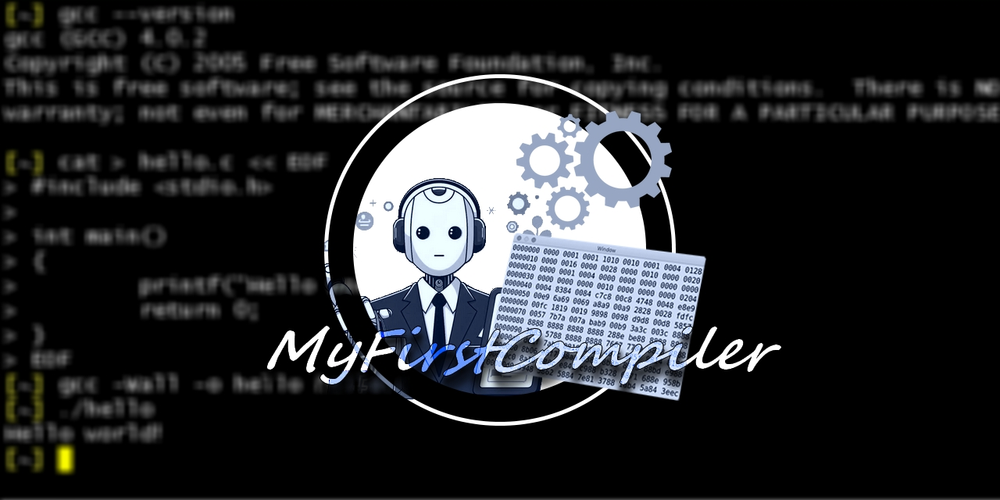

<p align="center">


</p>

# Manual de uso.

## Compilação e execução.
Para executar o código com o arquivo de entrada padrão ***Entradas/in.txt***:

```bash
make
```

Para especificar um arquivo de entrada PL/0, execute:

```bash
make IN="diretorio_do_seu_arquivo.txt"
```

Para adicionar um novo arquivo no código: em `C_FILES`, colocar um *\\* ao lado do ultimo .c e adicionar seu arquivo na proxima linha.

```Makefile
C_FILES := \
	$(SRC)/tabelas.c \
	$(SRC)/funcoes_saida.c \
	$(SRC)/analisador_lexico.c \
	$(SRC)/main.c
```

## Mensagens

As mensagens de debug do terminal também são salvas em um arquivo *log.txt*. Se você não quer mensagens de debug, configure, na main:

```
#define DEBUG_PRINT 0
```

O analisador léxico gera o arquivo *out.txt*, que contém os tokens.

## Tabelas

As tabelas são definidas em arquivos *txt*. Em ***transicoes.txt***, estão todas as funções de transição. Se você quer adicionar uma função de transição, escreva-o no início da linha da seguinte forma:

```
EstadoAtual Caractere EstadoProximo
```

Comentários podem ser adicionados, contanto que comecem com '//' e no início da linha. O código, assim que identificar esse '//', irá ignorar o resto da linha. Também acontece com linhas vazias.

A tabela de palavras reservadas do sistema está definida em ***palavras_reservadas.txt***.